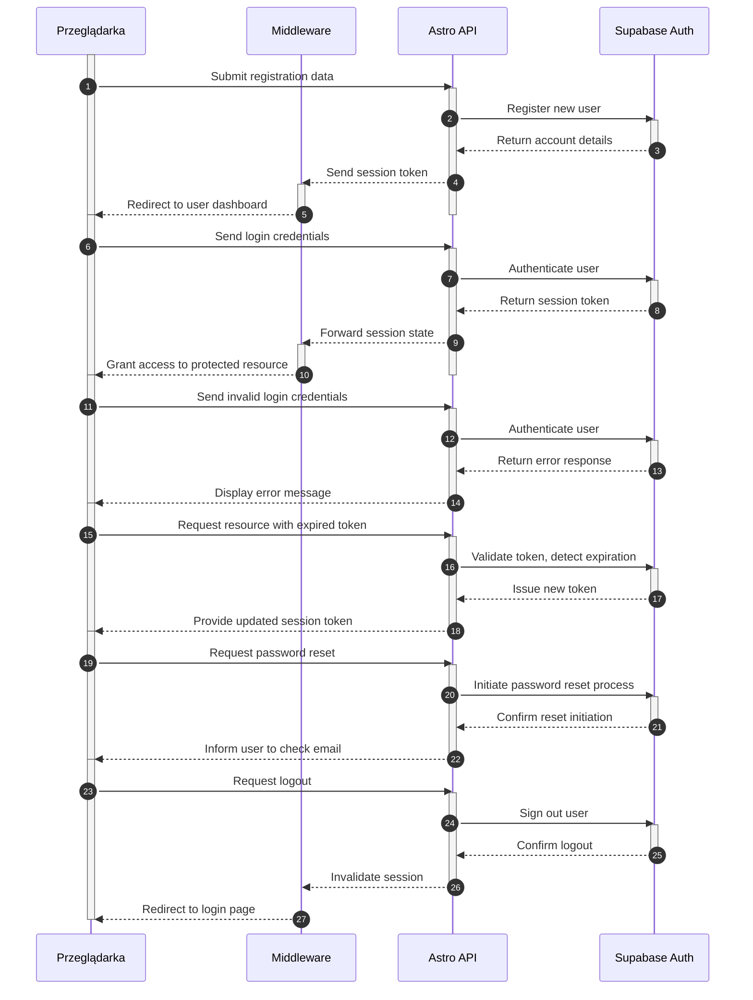

<authentication_analysis>
Analiza przepływów autentykacji:
1. Rejestracja: Użytkownik przesyła dane rejestracyjne poprzez formularz, które trafiają do Astro API i są przetwarzane przez Supabase Auth. Następnie Middleware weryfikuje sesję i przekierowuje użytkownika do panelu.
2. Logowanie: Użytkownik wysyła dane logowania do Astro API, który przekazuje je do Supabase Auth. Po pomyślnej weryfikacji, sesja zostaje potwierdzona przez Middleware, umożliwiając dostęp do chronionych zasobów.
3. Resetowanie hasła: Użytkownik inicjuje proces resetowania hasła, wysyłając odpowiednie żądanie, które jest przekazywane przez Astro API do Supabase Auth, a następnie użytkownik otrzymuje instrukcje resetowania.
4. Wylogowanie: Użytkownik żąda wylogowania, a żądanie przechodzi przez Astro API do Supabase Auth, a Middleware unieważnia bieżącą sesję i przekierowuje użytkownika do strony logowania.
5. Odświeżanie tokenu: W przypadku wygaśnięcia tokenu, Przeglądarka zgłasza żądanie, Astro API weryfikuje token z Supabase Auth, uzyskuje nowy token i przekazuje zaktualizowany stan sesji do użytkownika.
Główni aktorzy:
- Przeglądarka – interfejs użytkownika
- Astro API – backendowe endpointy autentykacji
- Supabase Auth – usługa autentykacji i zarządzania sesjami
- Middleware – mechanizm weryfikacji sesji i ochrony zasobów
</authentication_analysis>

<mermaid_diagram>

</mermaid_diagram> 